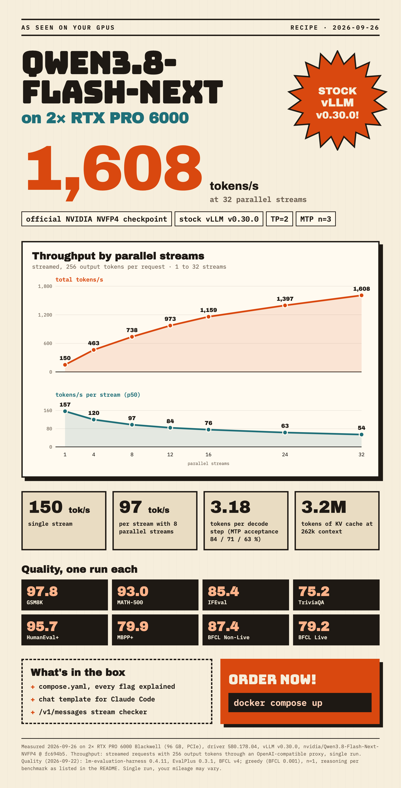

# Qwen3.8-Flash-Next (NVIDIA NVFP4) on 2× RTX PRO 6000



A tested vLLM configuration for the official NVIDIA NVFP4 checkpoint of Qwen3.8-Flash-Next on
two RTX PRO 6000 Blackwell cards, with stock vLLM v0.30.0, tensor parallelism 2 and the model's
built-in multi-token prediction (MTP) with 3 speculative tokens and probabilistic drafting.

## Tested setup (2026-09-26)

| | |
|---|---|
| GPUs | 2× NVIDIA RTX PRO 6000 Blackwell Workstation Edition, 96 GB each, PCIe, no NVLink |
| Driver / CUDA | 580.178.04 / CUDA 13.0 |
| Container runtime | Docker 29.1.3, Docker Compose 2.40.3, NVIDIA Container Toolkit 1.19.1 (required) |
| Power limit | 500 W per card |
| Image | `vllm/vllm-openai:v0.30.0@sha256:8a69ffad015f138d7170c4ddc429e230a3bc1c1719f67e14324749df200a4b90` |
| Model | `nvidia/Qwen3.8-Flash-Next-NVFP4` @ `fc694b54fb0174e0913e6adf86691ef85a4ead47` |
| Weights on GPU | 39.3 GiB per card |
| KV cache | 3,203,824 tokens (context 262,144, `gpu_memory_utilization` 0.95) |
| Host memory | about 65 GB shared memory in use (per-layer embeddings offloaded to the CPU) |

Reasoning, tool calling and image input work with this configuration.

## Quick start

```bash
git clone https://github.com/SirTificate/qwen3.8-flash-next-nvfp4-2x-rtx-pro-6000
cd qwen3.8-flash-next-nvfp4-2x-rtx-pro-6000

# 1. Download the weights (about 124 GB) into ./hf-cache, pinned to the tested revision
#    (needs the Hugging Face CLI: pip install -U huggingface_hub)
HF_HOME=$PWD/hf-cache hf download nvidia/Qwen3.8-Flash-Next-NVFP4 \
  --revision fc694b54fb0174e0913e6adf86691ef85a4ead47

# 2. Create an API key (docker compose reads .env automatically) and start
echo "VLLM_API_KEY=$(openssl rand -hex 32)" > .env
docker compose up -d
docker compose logs -f vllm      # weights load in about 2-3 minutes from local disk

# 3. Test
curl -s http://localhost:8000/v1/chat/completions \
  -H "Authorization: Bearer $(sed -n 's/^VLLM_API_KEY=//p' .env)" -H "Content-Type: application/json" \
  -d '{"model": "qwen3.8-flash-next", "messages": [{"role": "user", "content": "What is 17*23?"}]}'
```

The compose file uses the GPUs with `device_ids` `"0"` and `"1"`. Change the indices if your
cards are enumerated differently. The configuration needs exactly two GPUs.

## Why each flag is there

| Flag / variable | Why |
|---|---|
| `--quantization modelopt` | The checkpoint is an NVIDIA ModelOpt mixed-precision checkpoint (NVFP4 experts, FP8 MTP experts and per-layer embeddings). |
| `--tensor-parallel-size 2`, `--enable-expert-parallel` | Split the model across both cards, experts sharded by expert parallelism. |
| `--speculative-config {"method": "mtp", "num_speculative_tokens": 3, "draft_sample_method": "probabilistic"}` | Use the checkpoint's built-in MTP module. `"draft_sample_method": "probabilistic"` samples the draft tokens from the draft model's distribution instead of taking its most likely token. Requests with temperature > 0 accept more draft tokens; the output distribution stays the same (standard rejection sampling, the default). |
| `--gpu-memory-utilization 0.95` | Share of each card vLLM may use; the rest of the 96 GB beyond the weights becomes KV cache. |
| `--max-model-len 262144` | The model's native context length. |
| `--max-num-seqs 32` | Up to 32 concurrent requests; more are queued. |
| `--compilation-config ... "cudagraph_capture_sizes": [4, ..., 128]` | CUDA graphs up to 128 tokens per decode step, see pitfall 2. |
| `"mode": "NONE"`, `"cudagraph_mode": "FULL_DECODE_ONLY"` (in `--compilation-config`) | No torch.compile; full CUDA graphs for decode steps only. Part of the tested configuration. |
| `--max-num-batched-tokens 4096` | Prefill chunk budget per scheduler step. |
| `--no-enable-flashinfer-autotune` | Avoids a startup deadlock, see pitfall 1. |
| `--disable-custom-all-reduce` | vLLM's custom all-reduce was observed to crash during CUDA graph capture on this PCIe setup; kept in the tested configuration. |
| `--reasoning-parser qwen3` | Returns the reasoning separately from the answer. |
| `--tool-call-parser qwen3_coder`, `--enable-auto-tool-choice` | Structured tool calls. |
| `--chat-template` | The derived template, see pitfall 4. |
| `--trust-remote-code` | Part of the tested configuration. Probably not needed (the model's `config.json` has no `auto_map` and vLLM ships the architecture), but we have not tested without it. |
| `--revision`, `--code-revision`, `--tokenizer-revision` | Pin weights, code and tokenizer to the tested commit. |
| `VLLM_PLE_CPU_OFFLOAD=1` | Keeps the large per-layer embedding tables in pinned host memory instead of GPU memory, see pitfall 3. |
| `VLLM_USE_DEEP_GEMM=0`, `VLLM_MOE_USE_DEEP_GEMM=0` | DeepGEMM disabled. All numbers below were measured this way. |
| `PYTORCH_CUDA_ALLOC_CONF=expandable_segments:True` | Less memory fragmentation. |
| `CUDA_DEVICE_ORDER=PCI_BUS_ID` | Stable GPU numbering. |
| `ipc: host` (compose) | Shared memory between the tensor-parallel worker processes. |
| `VLLM_ALLOW_LONG_MAX_MODEL_LEN=1` | Should not be needed for the native 262,144 context; kept because it is part of the tested configuration. |
| `VLLM_API_KEY` | Required. The compose file refuses to start without it; the Quick start keeps it in `.env` (git-ignored). |

## Pitfalls

**1. Startup hangs on the second start (FlashInfer autotune).** With tensor parallelism 2, the
first start tunes the FlashInfer kernels and writes a cache. On the next start one rank hits the
cache and the other one tunes again, then waits forever for the other rank. Symptom: one GPU at
100 % utilization and only about 120 W, the log stops after "No available shared memory broadcast
block", and the server never comes up. `--no-enable-flashinfer-autotune` avoids it; we measured
no speed cost. Tracked upstream in vllm-project/vllm#57635 and #57579.

**2. CUDA graph sizes count tokens, not requests.** With MTP every request uses
`num_speculative_tokens + 1` tokens per decode step. vLLM rounds the configured
`cudagraph_capture_sizes` to multiples of that and drops everything above
`max_cudagraph_capture_size`. Decode steps larger than the biggest captured graph run without a
graph, and the speed per request roughly halves from that point on. The largest size must be
`max_num_seqs × (num_speculative_tokens + 1)`; here `32 × (3 + 1) = 128`. If you change either
value, change the sizes too.

**3. Per-layer embedding offload needs root and `SYS_PTRACE`.** `VLLM_PLE_CPU_OFFLOAD=1` keeps
the per-layer embedding tables in pinned host memory and shares them between the worker processes
over CUDA IPC. That needs the container to run as root with `SYS_PTRACE`. Plan for the host memory
(about 65 GB shared memory in our setup).

**4. The original chat template rejects two common client requests.** It raises an error for a
system message that is not the first message, which Claude Code sends when you type a correction
during a running tool call. It also rejects `reasoning_effort` values `high` and `minimal`. The
template in `chat_template/` fixes both; details and the full diff are in
`chat_template/NOTICE.md`.

Smaller notes:
- Thinking is on by default. Turn it off per request with `"reasoning_effort": "none"` or
  `"chat_template_kwargs": {"enable_thinking": false}`. A top-level `"enable_thinking": false` is
  ignored.
- The KV cache runs in bf16. The attention backend of this architecture does not support a
  quantized KV cache.

## Using it with Claude Code through a proxy

Claude Code speaks the Anthropic Messages API. If you put an OpenAI-compatible proxy such as
LiteLLM in front of vLLM, use **LiteLLM 1.101.0 or newer**. With MTP n=3, vLLM regularly sends a
single stream chunk that contains both the end of the reasoning and the start of the answer.
LiteLLM 1.94.0 put the reasoning of such a chunk into a text block, and Claude Code aborts with
`Content block is not a thinking block`. We verified that 1.101.0 splits these chunks correctly.

`scripts/check_messages_stream.py` checks your proxy. It sends streaming `/v1/messages` requests
with reasoning and validates every event sequence:

```bash
API_KEY=<proxy key> python3 scripts/check_messages_stream.py \
  --base-url http://<proxy>:<port> --model <model name at the proxy> -n 30
```

The last line should end with `0/30 streams with violations or errors`.

## Results

### Throughput

Streamed requests with a fixed output length of 256 tokens, sent through an OpenAI-compatible
proxy. Single run, 2026-09-26.

| Parallel streams | Total tok/s | Per stream p50 tok/s | TTFT p50 ms | ITL p50 ms |
|---|---|---|---|---|
| 1 | 150 | 157 | 119 | 5.9 |
| 4 | 463 | 120 | 155 | 7.7 |
| 8 | 738 | 97 | 159 | 9.6 |
| 12 | 973 | 84 | 172 | 11.2 |
| 16 | 1,159 | 76 | 221 | 12.3 |
| 24 | 1,397 | 63 | 201 | 15.1 |
| 32 | 1,608 | 54 | 223 | 17.5 |

The speed depends on the content. MTP predicts code better than prose. Measured directly at the
server (no proxy), a single stream decoded code at 237 tok/s and free-form prose at 174 tok/s
(median of 6 requests each, 512 output tokens, temperature 1.0, top_p 0.95, top_k 20).

MTP acceptance per draft position: 83.9 %, 71.4 %, 62.6 %, which gives 3.18 tokens per decode
step on average. Measured on 2026-09-26 over a mixed set of test prompts (long-context text,
verbatim copying, tool calls, code edits). Acceptance depends strongly on the content: expect
less for free-form chat, more for code.

### Prefill

One request at a time, 2026-09-26. Cold: a new prompt without a prefix-cache hit; prefill speed =
prompt tokens / (TTFT − 114 ms), where 114 ms is the TTFT of a 512-token prompt. Cached: the same
prompt again, served from the prefix cache.

| Prompt tokens | Cold TTFT ms | Cold prefill tok/s | Cached TTFT ms |
|---|---|---|---|
| 4k | 317 | 19,836 | 194 |
| 8k | 566 | 17,724 | 333 |
| 16k | 1,079 | 16,990 | 382 |
| 32k | 2,050 | 16,864 | 357 |
| 64k | 3,924 | 17,162 | 497 |
| 128k | 7,990 | 16,644 | 1,154 |

### Quality

| Benchmark | Score |
|---|---|
| GSM8K | 97.8 |
| MATH-500 | 93.0 |
| IFEval | 85.4 |
| TriviaQA | 75.2 |
| HumanEval+ | 95.7 |
| MBPP+ | 79.9 |
| BFCL Non-Live | 87.4 |
| BFCL Live | 79.2 |

Method: one run per benchmark (n=1), requests through an OpenAI-compatible proxy, measured on
2026-09-22 with the same configuration except `draft_sample_method`, which does not change the
output distribution.
- lm-evaluation-harness 0.4.11 (chat completions, chat template applied, few-shot as multi-turn):
  GSM8K 5-shot strict-match, MATH-500 0-shot with a `\boxed{}` prompt and boxed-answer extraction,
  IFEval prompt-level strict, TriviaQA 5-shot exact match. Greedy.
- EvalPlus 0.3.1: HumanEval+ and MBPP+ pass@1 on the plus tests. Greedy.
- BFCL v4 (bfcl-eval 2026.3.23), function-calling mode: Non-Live AST and Live. Temperature 0.001.
- Reasoning: `reasoning_effort` `medium` for GSM8K, MATH-500, HumanEval+ and MBPP+; `low` for
  BFCL; `none` for IFEval and TriviaQA. With reasoning on, max tokens was raised (8192, MATH-500
  32768) and GSM8K/MATH-500 stop only at `<|im_end|>`, because vLLM also applies stop sequences to
  the reasoning part.

## Caveats

- All numbers are single runs on one machine. Your numbers will differ.
- `--trust-remote-code` is probably unnecessary, but untested without it.
- Open upstream items: the FlashInfer autotune deadlock (#57635, #57579) and streamed tool-call
  arguments that can end up as invalid JSON when a request hits `max_tokens` (#53739).
- License: the model is under the NVIDIA Open Model License and the Qwen Community License 1.0.
  The Qwen license has separate terms for commercial "Model as a Service" and "AI Work Assistant"
  offerings; read it before offering the model to third parties. See `chat_template/NOTICE.md`.

## License

The files in this repository are MIT licensed, except `chat_template/`, see its `NOTICE.md`.
